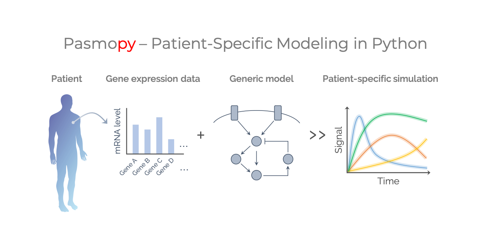

# The Pasmopy Project: Breast Cancer 

## Requirements

- [Manual installation of package requirements](https://github.com/pasmopy/breast_cancer/wiki/Manual-installation-of-package-requirements)

## Table of contents

1. [Integration of TCGA and CCLE data](https://github.com/pasmopy/breast_cancer/wiki/Integration-of-TCGA-and-CCLE-data)

1. [Construction of a comprehensive model of the ErbB signaling network](https://github.com/pasmopy/breast_cancer/wiki/Construction-of-a-comprehensive-model-of-the-ErbB-signaling-network)

1. [Individualization of the mechanistic model](https://github.com/pasmopy/breast_cancer/wiki/Individualization-of-the-mechanistic-model)

1. [Subtype classification based on the ErbB signaling dynamics](https://github.com/pasmopy/breast_cancer/wiki/Subtype-classification-based-on-the-ErbB-signaling-dynamics)

1. [Investigation of patient-specific pathway activities](https://github.com/pasmopy/breast_cancer/wiki/Investigation-of-patient-specific-pathway-activities)

## Author

- Hiroaki Imoto
- Sawa Yamashiro

## License

[Apache License 2.0](LICENSE)
